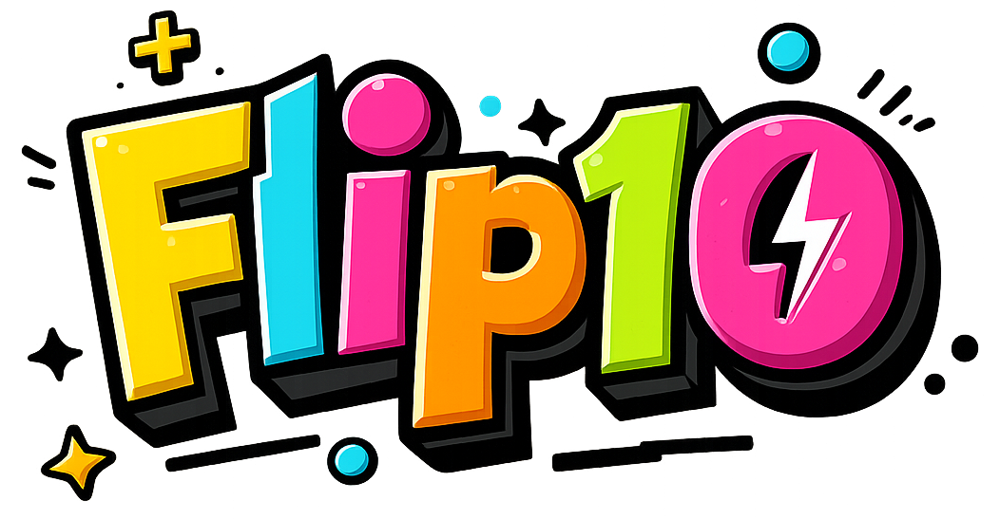

<p align="center">
  
</p>

<h3 align="center">🎰 The Ultimate On-Chain Coin Flip Battle Royale 🎰</h3>

<p align="center">
  <strong>Flip your way to victory. First to 10 heads wins it all.</strong>
</p>

<p align="center">
  <a href="https://flip10.xyz">🌐 Official Site</a> •
  <a href="#-how-it-works">How It Works</a> •
  <a href="#-features">Features</a> •
  <a href="#%EF%B8%8F-tech-stack">Tech Stack</a> •
  <a href="#-getting-started">Getting Started</a> •
  <a href="#%EF%B8%8F-architecture">Architecture</a>
</p>

---

## 🚀 What is Flip10?

**Flip10** is a real time, multiplayer coin flip roguelike where players compete in daily sessions to reach a **10 heads streak** and claim the **pooled prize**.

Every flip counts. Every second matters. One winner takes all.

> 💡 *Think battle royale meets provably fair gambling, powered by blockchain.*

---

## 🎮 How It Works

1. **Join a Session**  
   Connect your wallet and enter the daily session.

2. **Buy Flip Packages**  
   Purchase flip packages using ETH. Funds go directly to the prize pool.

3. **Start Flipping**  
   Flip the coin once per second. Build your streak. Watch the odds evolve.

4. **Race to 10 Heads**  
   The first player to land **10 consecutive heads** wins the entire prize pool!

5. **Claim Your Prize**  
   Winners claim their prize directly from the smart contract through the frontend.

---

## ✨ Features

| Feature | Description |
|---------|-------------|
| 🎲 **Provably Fair RNG** | Every flip is deterministic and verifiable on-chain |
| ⚡ **Real Time Gameplay** | Sub second latency with WebSocket powered updates |
| 🏆 **Live Leaderboard** | Watch players compete in real time |
| 💰 **On-Chain Prize Pools** | Funds secured by smart contracts on Base |
| 🎯 **Dynamic Odds** | Probability evolves based on session progress |
| 🔐 **Self Custody** | Your funds, your keys. No platform custody. |
| 🎨 **Immersive 3D UI** | Stunning coin flip animations with Three.js |

---

## 🏗️ Tech Stack

<p align="center">
  
</p>

### Smart Contracts
- **Solidity** `^0.8.24`
- **Foundry** (Forge) for testing & deployment
- **OpenZeppelin** security audited libraries

### Backend
- **Node.js** + **TypeScript**
- **Fastify** (HTTP + WebSocket server)
- **Ethers v6** for blockchain interactions
- Deterministic, reproducible RNG

### Frontend
- **React 18** + **TypeScript**
- **Vite** for blazing fast builds
- **wagmi** + **viem** for Web3 wallet integration
- **Three.js** + **React Three Fiber** for 3D graphics
- **Zustand** for state management

---

## 📁 Project Structure

```
Flip10/
├── contracts/     # Solidity smart contracts (Foundry)
├── backend/       # Game server (Node.js + WebSockets)
├── frontend/      # Web client (React + Three.js)
└── README.md      # You are here!
```

Each component has its own detailed README with setup instructions.

---

## 🚀 Getting Started

### Prerequisites
- Node.js 18+
- pnpm or npm
- Foundry (for contracts)
- A wallet with testnet ETH

### Quick Start

```bash
# Clone the repository
git clone https://github.com/PsyLabsWeb3/Flip10.git
cd Flip10

# Install dependencies for each component
cd contracts && forge install && cd ..
cd backend && npm install && cd ..
cd frontend && npm install && cd ..
```

See individual component READMEs for detailed setup:
- [📄 Contracts README](./contracts/README.md)
- [📄 Backend README](./backend/README.md)
- [📄 Frontend README](./frontend/README.md)

---

## 🏛️ Architecture

```
┌─────────────────┐     WebSocket     ┌─────────────────┐
│                 │◄─────────────────►│                 │
│    Frontend     │                   │     Backend     │
│   (React/3D)    │                   │   (Node.js)     │
│                 │                   │                 │
└────────┬────────┘                   └────────┬────────┘
         │                                     │
         │ wagmi/viem                          │ ethers.js
         │                                     │
         ▼                                     ▼
┌──────────────────────────────────────────────────────┐
│                                                      │
│               Flip10Sessions.sol                     │
│                (Base L2 Network)                     │
│                                                      │
└──────────────────────────────────────────────────────┘
```

**Key Design Principles:**
- 🎮 No per flip transactions (low latency, great UX)
- 🔒 On-chain escrow & settlement only
- ✅ Claim based payouts (gas efficient)
- 🛡️ Backend cannot access funds
- 📜 Provably fair, verifiable gameplay

---

## 📄 License

MIT License. See [LICENSE](LICENSE) for details.

---

<p align="center">
  <sub>powered by <strong>Psy Labs</strong></sub>
</p>
